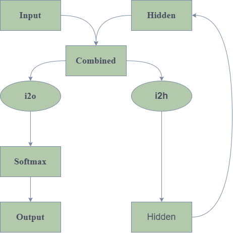
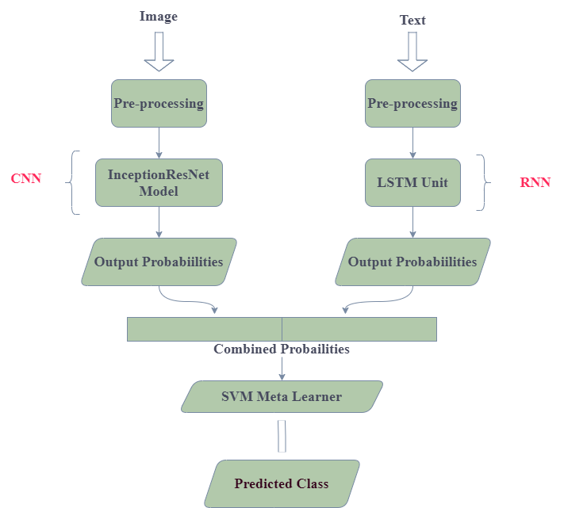

# e-commerce-classifier
**A predictive app is to be deployed soon based on this project.**

This consists of the notebook that predicts the category of the items of the e-commerce shopping list as given in the dataset to one of the 27 categories. You could find the dataset at https://www.kaggle.com/c/uw-cs480-fall20. This was a part of the Kaggle in-class competition. 

It includes a text classification technique using RNN with LSTM unit, image classification technique using InceptionResNet model and an ensemble learning technique.

## Text Classification
We have build and trained a basic RNN to classify the noisy text description into one of the 27 ctaegories. The RNN reads the description as a series of words - outputting a prediction and "hidden state" at each step. We take the final prediction to be the output i.e., which class the word belongs to.

## Preparing the Data
We pre-process the data by converting the text into ASCII and stemming them to get the words in the base form. Now, We build a dictionary of all unique words in the noisy text description of the products. We now turn the description into *tensors* to make use of them in the model. To represent a single word, we use "one-hot vector" of size `<1 x len(dictionary)>`. A one-hot vector is filled with 0s except for a 1 at index of the current word. We join a bunch of those 2D tensors to make a product description.

## Model
We usde *LSTM units* because it mitigates the problem of vanishing gradient and gradient explosion by the use of gated structures.

## Training
Now we train the model on the train dataset. For the loss function `nn.NLLLoss` is appropriate since the last layer of the RNN is `nn.LofSoftmax`. 
Each loop is trained by:

* creating input and target tensors
* creating a zeroed initial hidden state
* read each word in and keep hidden state for the next word
* comapre final output to target
* back propagate
* return the output and loss

## Image Classification
The image of each item can appear in different poses or even on or off human models. Our dataset consists of 43k images across 27 classes. And our training dataset contains 41.6k images. Currently, CNNs are the best machine learning models to classify images. Training these powerfulneural nets takes a lot of computing power and data. So, here we use a pre trained model(InceptionResNet) that has been trained on Image-Net dataset, since, it is capable of extracting useful features from images of a wide range of classes.

## Tying the models together

A predictive app is to be deployed soon based on this project.

